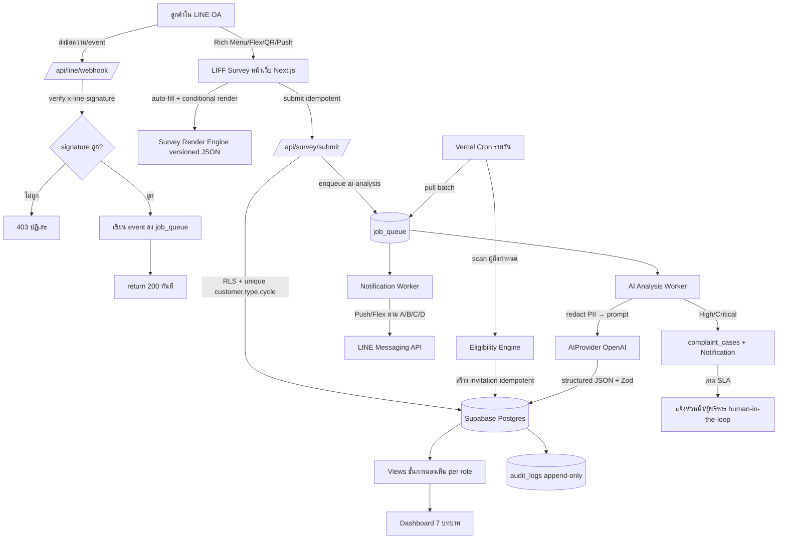
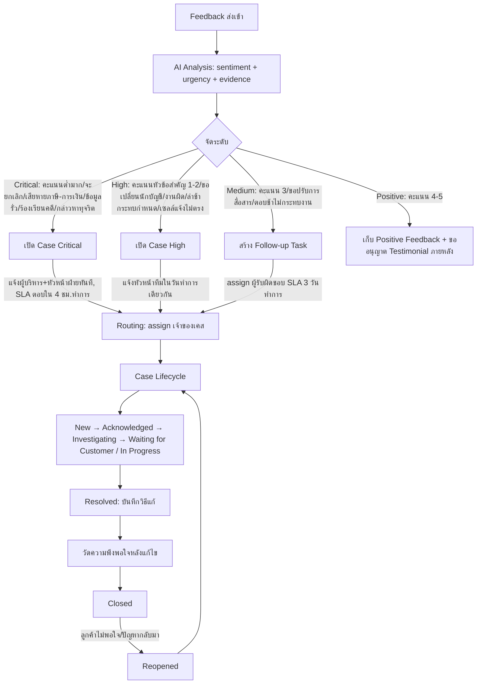
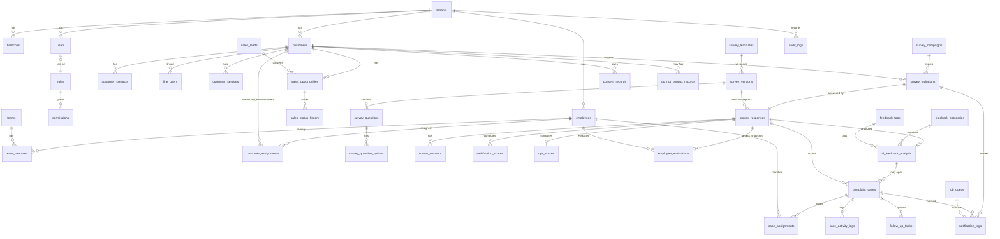

# 02-design.md — NOVA Customer Experience System (nova-cx) เอกสารออกแบบหลัก (Phase 2)

> อ้างอิง: `docs/00-brief.md`, `docs/01-requirements.md`, `docs/01-analysis.md`, `docs/01-arch-options.md`
> ยึดคำแนะนำสถาปัตยกรรมจาก 01-arch-options.md ทุกจุด และเคารพข้อห้าม C-01..C-16

---

## 1. Executive Summary

NOVA-CX คือระบบวัด/ติดตามคุณภาพบริการของ Finovas Accounting ผ่าน LINE OA + LIFF ที่ให้ลูกค้าตอบแบบประเมิน 4 ประเภท (A สำนักงาน/3 เดือน, B นักบัญชี/รายเดือน แยกหัวหน้า-ลูกทีม, C เซลล์ขายได้, D เซลล์ขายไม่ได้) โดยส่งอัตโนมัติจากสถานะจริงเพื่อกันการบิดเบือนคะแนน มี AI "น้อง NOVA" สรุปความคิดเห็นเป็น JSON ที่แยกข้อเท็จจริงจากข้อสันนิษฐาน จับสัญญาณเสี่ยงยกเลิก เปิด Complaint/Retention Case และแจ้งเตือนตามระดับเร่งด่วน (Critical/High/Medium/Positive) พร้อม Dashboard/Report แยกสิทธิ์ 7 บทบาท ทั้งหมดเป็น multi-tenant SaaS บน House Stack (Next.js + Supabase + Vercel + OpenAI) ที่เคารพ PDPA ด้วยโมเดล pseudonymous มีชั้นการมองเห็น (ไม่ใช่ anonymous 100%), redact PII ก่อนเข้า AI, temporal binding ผูก feedback กับผู้ดูแล ณ เวลาที่เกิดบริการจริง และ audit log แบบ append-only

---

## 2. User Roles (7 บทบาทพนักงาน + ลูกค้า)

| บทบาท | สิทธิ์โดยสังเขป | ขอบเขตข้อมูล (scope) |
|---|---|---|
| **ผู้บริหาร (Executive)** | ดู Dashboard/Report ทุกทีม/บริการ, เห็น aggregate + เคส Critical/High, อนุมัติ Testimonial | All (ภายใน tenant) |
| **หัวหน้าทีมบัญชี (Accounting Lead)** | ดูคะแนน/เคสของทีมตน, จัดการ routing เคส, ตรวจคำขอเปลี่ยนผู้ดูแล | Team (ทีมที่ตนคุม) |
| **นักบัญชี (Accountant)** | ดูคะแนนตัวเอง/แนวโน้ม/คำชม/จุดปรับปรุง/งานติดตาม — ไม่เห็นชื่อลูกค้า, ไม่เห็นลูกค้านอกความรับผิดชอบ (C-10) | Own (คะแนนของตน) |
| **หัวหน้าฝ่ายขาย (Sales Lead)** | ดูคะแนนเซลล์, Won/Lost, เหตุผลซื้อ-ไม่ซื้อ, ความชัดเจนเสนอราคา — ห้ามใช้คะแนนตัวเดียวตัดสิน (C-11) | Team (ทีมขาย) |
| **เซลล์ (Sales Rep)** | ดูคะแนนตัวเอง Won/Lost, ปลายเปิด — ไม่เห็นชื่อลูกค้า, ไม่เห็นดีลคนอื่น | Own |
| **Customer Service (CS)** | จัดการเคส, ติดต่อลูกค้า, บันทึกการติดตาม, เห็นตัวตนลูกค้าเท่าที่จำเป็นต่อเคส | Assigned cases |
| **Admin** | จัดการ user/role/team/assignment, template, tenant, seed, เข้าถึงตัวตนลูกค้าในกรณีร้องเรียน/ความปลอดภัย (ทุกครั้ง log) | All + admin functions |
| **ลูกค้า (Customer)** | LINE Login เท่านั้น, เปิด/ตอบเฉพาะแบบประเมินของตน (invitation token), ตรวจสถานะเรื่องร้องเรียนของตน, ใช้สิทธิ PDPA | เฉพาะข้อมูลของตน |

> พนักงานใช้ Supabase Auth (RBAC) — ลูกค้าใช้ LINE Login — คนละ auth domain (FR-RB-02)

---

## 3. User Journey (ลูกค้า)

```
1. รับ invitation → Push/Flex Message ใน LINE OA ("น้อง NOVA อยากขอความเห็น 2 นาที")
2. แตะปุ่ม → เปิด LIFF (/liff/survey/[token]) → Loading Animation (นกอินทรีวิ่ง)
3. LIFF init + LINE Login → ตรวจ token ผูก line_user + ยังไม่หมดอายุ + ยังไม่ตอบ
4. หน้า PDPA Consent (ครั้งแรก/เมื่อ policy เปลี่ยน) → ต้องกดยินยอมก่อนเริ่ม
5. ตอบแบบประเมิน: auto-fill ข้อมูลอ้างอิง → ให้คะแนน → conditional follow-up ตามคะแนน
   - auto-save ทุกการเปลี่ยน (localStorage), Progress Bar, ปุ่มย้อนกลับ, บอกเวลาโดยประมาณ
   - เน็ตหลุด → ไม่เสียคำตอบ, Offline State, sync เมื่อกลับมา
6. หน้า Review-before-submit → ตรวจก่อนส่ง
7. Submit (idempotent) → Confirmation ("ขอบคุณค่ะ น้อง NOVA รับเรื่องแล้ว")
8. ผลลัพธ์เบื้องหลัง: AI วิเคราะห์ → ถ้าลบ/เสี่ยง เปิดเคส + แจ้งทีม → CS ติดต่อกลับ (ถ้าลูกค้าเลือก)
9. ลูกค้าตรวจสถานะเรื่องร้องเรียนได้ผ่าน Rich Menu; ได้ข้อความ update เมื่อเคสคืบหน้า/ปิด
```

---

## 4. System Flow (mermaid)



---

## 5. Survey Flow (4 แบบประเมิน A/B/C/D)

| แบบ | Trigger | ส่วนประกอบหลัก | ผลลัพธ์ |
|---|---|---|---|
| **A สำนักงาน** | ทุก 3 เดือนจากวันเริ่มบริการ (หรือรอบกลางรวม) | 6 ส่วน: ข้อมูลอ้างอิง(auto-fill), คะแนน 1–5 x10, ปัญหาที่พบ(multi-select+"ยังไม่พบปัญหา"เลือกเดี่ยว), บริการเสริม, Loyalty/NPS/แนวโน้มใช้ต่อ, การติดต่อกลับ | CSAT/NPS/CES, สัญญาณเสี่ยงยกเลิก, เคสถ้าคะแนนต่ำ/ขอยกเลิก |
| **B นักบัญชี** | เดือนละครั้ง (ไม่มี interaction เดือนนั้น เลื่อน/ข้ามได้) | เลือกผู้ถูกประเมิน (หัวหน้า 7 ข้อ / ลูกทีม 10 ข้อ / ทั้งทีม / จำไม่ได้) + แสดงรูป/ชื่อเล่น/ตำแหน่งของผู้ดูแล **ช่วงเวลานั้น** (snapshot), ปลายเปิด, ปัญหาเฉพาะนักบัญชี | คะแนนต่อ employee (จาก snapshot), เคสขอเปลี่ยนผู้ดูแล → ตรวจโดยหัวหน้า |
| **C เซลล์ Won** | หลังยืนยันซื้อ/ชำระเงิน เว้น 1–3 วัน (เซลล์ห้ามเลือกส่งเอง C-08) | 10 ข้อคะแนน + ปลายเปิด (รับปากเกินใบเสนอราคา?) + เหตุผลตัดสินใจซื้อ (multi-choice) | คะแนนเซลล์ Won, สัญญาณรับปากเกินขอบเขต |
| **D เซลล์ Lost** (สั้น) | ปิด Lost / ไม่ตอบหลังติดตามครบเกณฑ์ | ข้อความเปิดสุภาพ + 5 คำถามหลัก + เหตุผลไม่ตัดสินใจ(choice) + สิ่งที่ปรับแล้วพิจารณาใหม่ + ระดับอนุญาตติดต่อ | เหตุผล Lost, **"ไม่ต้องการรับติดต่ออีก" → Do Not Contact + หยุด sales automation ทันที (C-13, FR-NT-06)** |

**กติกาส่ง:** ถูกประเภท/ถูกคน, 1 คำตอบต่อลูกค้า/รอบ/ประเภท, 1 ครั้งต่อดีล, trigger จากสถานะจริงเท่านั้น

---

## 6. Conditional Question Logic (pseudo-rule)

```
# ระดับคะแนนต่อข้อ (1–5)
ON answer(question q, score s):
    IF s >= 4:            ask_followup(q, "PRAISE")     # สิ่งที่ทำได้ดี
    ELIF s == 3:          ask_followup(q, "IMPROVE")    # เรื่องที่อยากให้ปรับปรุง
    ELIF s <= 2:          ask_followup(q, "ROOT_CAUSE") # หาสาเหตุ + เสนอ "ติดต่อกลับ"

# follow-up เฉพาะเรื่อง (topic-specific)
IF problem == "งานผิด":        ask("ประเภทงาน?", "วันที่?", "รายละเอียด?")
IF problem == "ตอบช้า":        ask("รอนานเท่าใด?")
IF problem == "ค่าใช้จ่ายไม่ชัด": ask("รายการใด?")

# ตัวเลือก "ยังไม่พบปัญหา / ไม่มีปัญหา" = เลือกเดี่ยว
ON select_problem_option(opt):
    IF opt == "ยังไม่พบปัญหา":  clear_other_selections(); lock_others()
    ELSE:                       IF "ยังไม่พบปัญหา" selected: unselect_it()

# กระบวนการพิเศษ
IF request == "ขอเปลี่ยนผู้ดูแล": route_to(team_lead, review_flow)
IF intent == "ขอยกเลิกบริการ":    create_case(type="Retention", level="Critical")

# NOTE: validate ทั้ง client-side (UX) และ server-side (กันเลี่ยง) — logic อยู่ใน versioned JSON schema ไม่ hardcode
```

> keyword เสี่ยง ("สรรพากร/ค่าปรับ/เสียหาย/ฟ้อง/ข้อมูลรั่ว/เอกสารหาย/ยกเลิก/คืนเงิน") → ยกเป็นเรื่องสำคัญให้มนุษย์ตรวจ แต่ **AI ห้ามตัดสินจาก keyword เดี่ยว ต้องดูบริบท (C-04)**

---

## 7. Complaint Escalation Flow (mermaid)



---

## 8. Information Architecture

### (ก) LIFF ลูกค้า (mobile-first)
```
/liff
 ├─ /survey/[token]           แบบประเมิน (loading → consent → form → review → confirm)
 ├─ /report-issue            แจ้งปัญหาด่วน
 ├─ /contact                 ติดต่อทีมดูแล
 ├─ /cases                   ตรวจสอบสถานะเรื่องร้องเรียนของตน
 ├─ /faq                     คำถามที่พบบ่อย
 └─ /privacy                 นโยบายข้อมูลส่วนบุคคล (PDPA)
```

### (ข) Back-office Dashboard (Next.js + Supabase Auth)
```
/app
 ├─ /dashboard               ภาพรวมตามบทบาท (exec/lead/accountant/sales-lead/sales/cs)
 ├─ /surveys                 รายการแบบประเมิน + campaign + invitation status
 ├─ /feedback                รายการ feedback (view ตามสิทธิ์, ตัด PII สำหรับผู้ถูกประเมิน)
 ├─ /cases                   Case management (list/detail/activity/SLA)
 ├─ /customers               ฐานลูกค้า + assignment history (Admin/Lead/CS)
 ├─ /employees               พนักงาน/ทีม/assignment (Admin)
 ├─ /reports                 รายงาน + Export CSV/XLSX/PDF ตามสิทธิ์
 ├─ /notifications           Notification center
 └─ /admin                   users/roles/teams/templates/tenant/consent/audit
```

---

## 9. Database ERD (mermaid)



---

## 10. Database Schema (outline / DDL ย่อ)

> มาตรฐานทุกตาราง: `id UUID PK default gen_random_uuid()`, `tenant_id UUID NOT NULL` (RLS), `created_at/updated_at/deleted_at timestamptz` (soft delete), FK มี index

**Identity / Tenant**
```
tenants(id, name, status)
branches(id, tenant_id, name, code)
users(id, tenant_id, auth_user_id, employee_id, role_id, email, is_active)   -- พนักงาน (Supabase Auth)
roles(id, tenant_id, code[executive|acc_lead|accountant|sales_lead|sales|cs|admin], name)
permissions(id, role_id, resource, action, scope[none|own|team|all])
```

**Employee / Team / Assignment (effective-dated) ★**
```
employees(id, tenant_id, first_name, nickname, position, photo_url, employee_type[accountant|sales], is_active)
teams(id, tenant_id, name, type[accounting|sales], lead_employee_id)
team_members(id, tenant_id, team_id, employee_id, role_in_team[lead|member|coordinator], valid_from, valid_to)
customer_assignments(id, tenant_id, customer_id, employee_id, team_id,
    role[lead|member|coordinator], valid_from, valid_to NULL=current)   -- history, ห้าม overwrite
```

**Customer / LINE**
```
customers(id, tenant_id, customer_code, name, business_name, service_start_date, status[active|cancelled])
customer_contacts(id, tenant_id, customer_id, name, phone_enc, email_enc, is_primary)  -- PII เข้ารหัส
line_users(id, tenant_id, customer_id, line_user_id, display_name, is_blocked, linked_at)
customer_services(id, tenant_id, customer_id, service_type, started_at, ended_at)
```

**Sales**
```
sales_leads(id, tenant_id, name, source, status)
sales_opportunities(id, tenant_id, customer_id, sales_employee_id, stage, amount, status[won|lost|open], closed_at)
sales_status_history(id, tenant_id, opportunity_id, from_status, to_status, changed_at)
```

**Survey (versioned) ★**
```
survey_templates(id, tenant_id, survey_type[A|B|C|D], name, is_active)
survey_versions(id, tenant_id, template_id, version_no, schema_json JSONB, published_at)  -- โครง+conditional logic
survey_questions(id, version_id, code, text, type[rating|single|multi|open|nps], order_no, config_json)
survey_question_options(id, question_id, value, label, is_exclusive)  -- is_exclusive = "ยังไม่พบปัญหา"
survey_campaigns(id, tenant_id, survey_type, cycle_label, period_start, period_end)
```

**Invitation / Response / Answer**
```
survey_invitations(id, tenant_id, campaign_id, customer_id, line_user_id, survey_type,
    survey_version_id,              -- ล็อกเวอร์ชัน
    cycle_period,                   -- ใช้ทำ unique
    assignee_snapshot JSONB,        -- ★ snapshot ผู้ดูแล ณ วัน trigger (employee_id/name/role)
    token, token_expires_at,
    status[pending|sent|opened|responded|expired],
    reminder_count, idempotency_key,
    UNIQUE(customer_id, survey_type, cycle_period))     -- ★ กันซ้ำ (FR-SC-05)
survey_responses(id, tenant_id, invitation_id, customer_id,
    survey_template_version,        -- ★ เก็บ version ทุกคำตอบ (FR-SV-09)
    identity_mode[identified|limited_display],          -- โหมดแสดงตัวตน
    submitted_at, is_locked, edit_window_expires_at)
survey_answers(id, response_id, question_code, value_json, created_at)   -- append-only, version history
```

**Evaluation / Scores**
```
employee_evaluations(id, tenant_id, response_id, employee_id,   -- employee_id จาก snapshot ★
    subject_role[lead|member|team|unknown], avg_score)
satisfaction_scores(id, response_id, dimension, score)          -- CSAT ต่อข้อ/ภาพรวม
nps_scores(id, response_id, score_0_10, category[promoter|passive|detractor])
```

**AI Analysis**
```
feedback_categories(id, tenant_id, code, label)
feedback_tags(id, tenant_id, code, label)
ai_feedback_analysis(id, tenant_id, response_id,
    summary, sentiment[positive|neutral|negative], urgency[critical|high|medium|positive],
    customer_facts JSONB, ai_assumptions JSONB, evidence JSONB,    -- ★ แยกข้อเท็จจริง/สันนิษฐาน (C-03)
    next_best_action, draft_reply, confidence NUMERIC,
    model, provider, needs_human_review BOOL,
    validated BOOL)   -- ผ่าน Zod schema หรือไม่
```

**Case / Activity**
```
complaint_cases(id, tenant_id, case_no, response_id, customer_id, type[complaint|retention|reassign_request|positive],
    level[critical|high|medium|positive], status[new|ack|investigating|waiting_customer|in_progress|resolved|closed|reopened],
    sla_due_at, resolution, closed_at, post_resolution_csat)
case_assignments(id, tenant_id, case_id, owner_employee_id, assigned_at)
case_activity_logs(id, tenant_id, case_id, actor_user_id, action, note, created_at)  -- append-only
follow_up_tasks(id, tenant_id, case_id, assignee_employee_id, due_at, status)
```

**Notification / Queue**
```
job_queue(id, tenant_id, queue[notification|ai_analysis], payload JSONB,
    status[pending|processing|sent|failed|dead], attempts, max_attempts, run_at, locked_at, last_error)
notification_logs(id, tenant_id, target[customer|employee], channel[line|email|dashboard],
    ref_type[invitation|case], ref_id, status[sent|failed], provider_message_id, error, sent_at)
cron_health(id, job_name, last_run_at, status)   -- health-check (บทเรียน cron เงียบ)
```

**Consent / DNC / Audit**
```
consent_records(id, tenant_id, customer_id, policy_version, purpose_json, consented_at, withdrawn_at)
do_not_contact_records(id, tenant_id, customer_id, source[form_D|request], effective_at, reason)  -- ★ หยุด automation
audit_logs(id, tenant_id, actor_user_id, action, resource, resource_id, meta JSONB, created_at)  -- ★ append-only, immutable
```

**Key constraints สำคัญ:** UUID ทุกตาราง · tenant_id + RLS · soft delete · `UNIQUE(customer_id, survey_type, cycle_period)` · assignment effective-dated (valid_from/valid_to) · assignee snapshot ใน invitation · survey_template_version ทุก response · audit/answer append-only · PII เข้ารหัส (`_enc`)

---

## 11. API Specification

> ทุก endpoint พนักงานผ่าน Supabase Auth + RBAC + RLS; endpoint ลูกค้าผ่าน invitation token; รูปแบบ REST, input validate ด้วย Zod

| กลุ่ม | Endpoint | Method | สิทธิ์ | คำอธิบาย |
|---|---|---|---|---|
| **Auth** | `/api/auth/session` | GET | พนักงาน | session ปัจจุบัน + role/scope |
| **LINE Webhook** | `/api/line/webhook` | POST | LINE (verify sig) | verify x-line-signature → enqueue → return 200 (FR-LN-04) |
| **LIFF Survey** | `/api/liff/survey/[token]` | GET | ลูกค้า (token) | โหลด schema + auto-fill + assignee snapshot (ตรวจ token/หมดอายุ/ยังไม่ตอบ) |
| **Consent** | `/api/liff/consent` | POST | ลูกค้า (token) | บันทึก consent_records ก่อนเริ่ม |
| **Survey Submit** | `/api/survey/submit` | POST | ลูกค้า (token) | บันทึก response/answers (idempotent, unique constraint) → enqueue ai-analysis |
| **Survey Save** | `/api/survey/autosave` | POST | ลูกค้า (token) | (ทางเลือก) sync auto-save จาก client |
| **Customer Cases** | `/api/liff/cases` | GET | ลูกค้า (token) | สถานะเรื่องร้องเรียนของตน |
| **Cases** | `/api/cases` `/api/cases/[id]` | GET/POST/PATCH | CS/Lead/Exec/Admin (scope) | list/detail/update สถานะ+activity+SLA |
| **Feedback** | `/api/feedback` | GET | ตามบทบาท (view) | อ่านผ่าน view ชั้นการมองเห็น (ตัด PII สำหรับผู้ถูกประเมิน) |
| **Dashboard** | `/api/dashboard/[role]` | GET | ตามบทบาท | metrics + Response Rate + Sample Size |
| **Reports** | `/api/reports` `/api/reports/export` | GET/POST | ตามสิทธิ์ | filter + Export CSV/XLSX/PDF |
| **Admin** | `/api/admin/users|roles|teams|assignments|templates` | CRUD | Admin | จัดการ master data + assignment history |
| **Admin identity** | `/api/admin/customer/[id]/identity` | GET | Admin (authorized) | เปิดตัวตนลูกค้า → **บังคับ log audit** (FR-PD-04) |
| **Cron** | `/api/cron/scan-invitations` | POST | Vercel Cron (secret) | scan ผู้ถึงกำหนด → สร้าง invitation (idempotent) |
| **Worker** | `/api/worker/notification` `/api/worker/ai-analysis` | POST | Cron/internal (secret) | pull job_queue เป็น batch + retry |
| **Health** | `/api/health` | GET | internal | health check + cron last-run |

---

## 12. LINE OA & LIFF Integration Plan

**Webhook:** `POST /api/line/webhook` → (1) verify `x-line-signature` ด้วย channel secret, ไม่ผ่าน = 403 (FR-LN, R11) → (2) เขียน event ลง `job_queue` → (3) `return 200` ทันที (ไม่ประมวลผลหนัก inline) → worker ประมวลผลจริงภายหลัง

**Rich Menu (6 เมนู):** ประเมินการบริการ / แจ้งปัญหาด่วน / ติดต่อทีมดูแล / ตรวจสอบสถานะเรื่องร้องเรียน / คำถามที่พบบ่อย / นโยบายข้อมูลส่วนบุคคล — แต่ละเมนู deep-link เข้า LIFF route ที่เกี่ยวข้อง

**Flex / Push:** invitation ส่งเป็น Flex Message (การ์ดน้อง NOVA + ปุ่มเปิด LIFF) ผ่าน Messaging API ใน notification worker; reminder ≤2 ครั้งมีระยะห่าง; หยุดเมื่อประเมินแล้ว/ยกเลิก/DNC/block

**LIFF host:** หน้า LIFF อยู่ใน Next.js app เดียวกัน (`/liff/*`) บน Vercel (HTTPS), ใช้ LIFF SDK + LINE Login

**Invitation token security:** token ผูก `invitation_id + line_user_id`, มี `token_expires_at`, single-use (ตอบแล้ว lock), ตรวจ line_user ตรงกับเจ้าของ invitation กันคนอื่นเปิด (FR-LN-05, R-token)

**Q4/Q5 default:** dev channel ระหว่างพัฒนา; OA ลูกค้า 1 ช่อง + ช่องแจ้งเตือนภายในแยก; แจ้งเตือนทีมภายใน = Messaging API push + Email fallback + Dashboard notification center (notifier แบบ pluggable); env เติมผ่าน Vercel CLI

---

## 13. AI Agent Specification (น้อง NOVA)

**Pipeline:**
```
response → [1] redact PII (เบอร์/อีเมล/เลขภาษี/ชื่อ) → [2] build prompt (persona + guardrails + evidence rule)
→ [3] OpenAI call response_format=json_schema → [4] Zod validate
→ ผ่าน: บันทึก ai_feedback_analysis | ไม่ผ่าน: retry 1 ครั้ง → ยังไม่ผ่าน: flag needs_human_review=true
→ [5] post-filter guardrail (กันคำสัญญาชดเชย/คืนเงิน/"รับรองไม่เกิดอีก")
→ [6] ถ้า urgency High/Critical → เปิด case + human-in-the-loop (draft_reply ต้องมนุษย์ approve ก่อนส่ง)
```

**Output schema (structured JSON):**
```json
{
  "summary": "สรุปใจความสั้น",
  "customer_facts": ["ข้อเท็จจริงที่ลูกค้าระบุ"],
  "ai_assumptions": ["ข้อสันนิษฐานของ AI (ระบุว่าเป็นสมมติฐาน)"],
  "evidence": [{"claim": "...", "quote": "ข้อความอ้างอิงจากคำตอบ"}],
  "categories": ["หมวดปัญหา"],
  "sentiment": "positive|neutral|negative",
  "urgency": "critical|high|medium|positive",
  "urgency_reason": "เหตุผล+ข้อมูลที่ใช้จัดระดับ",
  "affected": {"employee": null, "team": null, "service": null, "period": null},
  "repeat_issue": true,
  "next_best_action": "แนวทางที่ควรทำ (ไม่ใช่คำสัญญา)",
  "draft_reply": "ร่างข้อความตอบลูกค้า",
  "confidence": 0.0
}
```

**Guardrails (C-01..C-04):**
- C-01/C-02: ห้ามรับปากค่าชดเชย/คืนเงิน/ลดราคา/ผลลัพธ์, ห้าม "รับรองว่าจะไม่เกิดขึ้นอีก", ห้ามวินิจฉัยข้อพิพาท/ยอมรับผิดแทนบริษัท (system prompt + post-filter blocklist)
- C-03: ห้ามสรุปพนักงานผิดโดยไม่มีหลักฐาน → แยก `customer_facts` vs `ai_assumptions` + ทุกข้อสรุปมี `evidence`; ผลลัพธ์เป็น "ประเด็นที่ควรตรวจสอบ" ไม่ใช่ "คำตัดสิน"
- C-04: keyword เสี่ยง → escalate แต่ต้องวิเคราะห์บริบท ไม่จัดระดับจาก keyword เดี่ยว
- C-15: redact PII ก่อนส่งเข้า AI เสมอ

**Human-in-the-loop:** High/Critical → draft_reply ต้องให้เจ้าของเคสตรวจ/แก้/อนุมัติก่อนส่ง (FR-AI-04)

**Persona น้อง NOVA:** เป็นมิตร สุภาพ น่ารัก สั้นกระชับ ไม่ถามซ้ำ ไม่กดดันให้คะแนนดี ไม่เข้าข้างพนักงาน/สำนักงาน; feedback ลบ → ขอบคุณ + ยืนยันส่งต่อผู้รับผิดชอบ

**Provider (Q8 default):** OpenAI ผ่าน interface `AIProvider` (รุ่น mini สำหรับสรุป/จัดหมวด), สลับ provider ได้, redact ก่อนส่ง

---

## 14. Notification Rules

| ระดับ | เงื่อนไข (ตัวอย่าง) | ผู้รับ | ช่องทาง | SLA (Q9 default) |
|---|---|---|---|---|
| **Critical** | คะแนนต่ำมาก / จะยกเลิก / เสียหายภาษี-การเงิน / ข้อมูลรั่ว-เอกสารหาย / ร้องเรียนคดี / กล่าวหาทุจริต | ผู้บริหาร + หัวหน้าฝ่าย (ทันที) | LINE push + Email + Dashboard | แจ้งทันที, ตอบใน 4 ชม.ทำการ |
| **High** | คะแนนหัวข้อสำคัญ 1–2 / ขอเปลี่ยนนักบัญชี / งานผิด / ล่าช้ากระทบกำหนด / เซลล์แจ้งไม่ตรงบริการจริง | หัวหน้าทีมที่เกี่ยวข้อง | LINE push + Dashboard | ภายในวันทำการเดียวกัน |
| **Medium** | คะแนน 3 / ขอปรับการสื่อสาร / ตอบช้าไม่กระทบงาน | ผู้รับผิดชอบ (สร้าง Follow-up Task) | Dashboard | 3 วันทำการ |
| **Positive** | คะแนน 4–5 | เก็บ Positive Feedback | Dashboard | — (ขออนุญาต Testimonial ภายหลัง C-12) |

> ทุกการส่งบันทึก `notification_logs` + retry เมื่อ fail (FR-NT-05); เวลาทำการ จ-ศ 9:00–18:00; Do Not Contact → หยุด sales automation ทันที (FR-NT-06)

---

## 15. Permission Matrix (บทบาท × ทรัพยากร)

| บทบาท \ ทรัพยากร | Survey/Campaign | Feedback (คำตอบ) | Customer identity | Case | Dashboard | Report | Admin |
|---|---|---|---|---|---|---|---|
| ผู้บริหาร | All (read) | All (aggregate) | On-demand + audit | All | All | All | — |
| หัวหน้าทีมบัญชี | Team (read) | Team | เฉพาะเคสทีม | Team | Team | Team | — |
| นักบัญชี | Own | Own (**ไม่เห็นชื่อลูกค้า**) | None | Own tasks | Own | Own | — |
| หัวหน้าฝ่ายขาย | Team (read) | Team | เฉพาะเคสทีม | Team | Team (Won/Lost) | Team | — |
| เซลล์ | Own | Own (**ไม่เห็นชื่อลูกค้า**) | None | Own | Own | Own | — |
| CS | Assigned | Assigned cases | เท่าที่จำเป็นต่อเคส | Assigned | CS view | Own | — |
| Admin | All (CRUD) | All | **On-demand + audit บังคับ** | All | All | All | All |

**หมายเหตุ RLS:** ชั้น 1 RLS บังคับ `tenant_id` ทุกตาราง (fail-safe ข้าม tenant); ชั้น 2 scope ตาม `customer_assignments` **ณ ช่วงเวลานั้น** (history ไม่ใช่ current); การซ่อนชื่อลูกค้าจากผู้ถูกประเมินทำที่ **view/column-level** ไม่ใช่ frontend; deny-by-default; Admin เปิดตัวตน = audit ทุกครั้ง (C-07, C-10)

---

## 16. PDPA & Security Checklist

- [ ] **Consent ก่อนเริ่ม** (FR-PD-01): แจ้งวัตถุประสงค์/ประเภทข้อมูล/ผู้เข้าถึง/ระยะเวลาเก็บ/ช่องทางใช้สิทธิ/การใช้ AI/การขอติดต่อกลับ → `consent_records` + policy_version
- [ ] **สิทธิ์เจ้าของข้อมูล:** ถอน/ลบ/เข้าถึง (FR-PD-02)
- [ ] **Visibility layers (pseudonymous ไม่ใช่ anonymous 100%, C-07):** 3 ชั้น — ผู้ถูกประเมินเห็นคะแนน+ข้อความ (ไม่เห็นชื่อ) / หัวหน้า-ผู้บริหารเห็น aggregate+เคส / Admin เข้าถึงตัวตนเฉพาะเคสร้องเรียน-ความปลอดภัย + audit ทุกครั้ง
- [ ] **Redact PII ก่อน AI** (C-15): เบอร์/อีเมล/เลขภาษี/ชื่อ
- [ ] **Encryption:** PII เข้ารหัส (`_enc`); ห้ามเก็บ LINE Access Token plain text (C-14); `CREDENTIAL_ENC_KEY` ตั้งครั้งเดียวห้ามเปลี่ยน (memory/R10)
- [ ] **Retention (Q7 default):** survey/case 3 ปี, audit/consent 5 ปี, ครบกำหนด anonymize แทน hard delete (รอยืนยันกฎหมายบัญชี)
- [ ] **Audit:** ทุก action สำคัญ (แก้คะแนน/Admin เปิดตัวตน/ส่งแบบประเมิน) append-only immutable
- [ ] **Token security:** invitation token ผูก line_user + หมดอายุ + single-use; webhook verify signature; cron/worker secret
- [ ] **No secret in code** (C-14): ใช้ `.env` + `.env.example`, `.env*` ใน `.gitignore`

---

## 17. Wireframe (โครงต่อหน้า)

**LIFF Loading**
- กลางจอ: mascot นกอินทรีวิ่ง + เครื่องคิดเลขขยับ + เอกสารปลิว (loop 1–2s)
- ข้อความสลับ ("กำลังเตรียมแบบประเมิน…" / "แป๊บเดียวนะคะ")
- >5s → ปุ่ม "ลองใหม่" + "แจ้งปัญหา"

**PDPA Consent**
- หัวข้อ + สรุปวัตถุประสงค์/ข้อมูล/ผู้เข้าถึง/ระยะเวลา (bullet อ่านง่าย) + ลิงก์นโยบายเต็ม
- ปุ่มใหญ่ "ยินยอมและเริ่ม" / "ไม่ยินยอม"

**Survey (คะแนน + conditional)**
- Progress Bar + "เหลืออีกประมาณ X นาที" ด้านบน
- ข้อมูลอ้างอิง auto-fill (แสดงแบบ read-only การ์ด)
- คำถามคะแนน 1–5 เรียงต่ำ→สูงชัดเจน (ไม่ชี้นำ, ปุ่มใหญ่)
- follow-up ปรากฏใต้ข้อเมื่อเข้าเงื่อนไข; "ยังไม่พบปัญหา" กดแล้วล้างตัวเลือกอื่น
- ปุ่มย้อนกลับ + auto-save (badge "บันทึกแล้ว")

**Review-before-submit**
- สรุปคำตอบทั้งหมด แก้รายข้อได้ → ปุ่ม "ส่งแบบประเมิน"

**Confirmation**
- mascot ยิ้ม + "ขอบคุณค่ะ น้อง NOVA รับเรื่องแล้ว" + (ถ้าเลือกติดต่อกลับ) "ทีมจะติดต่อกลับตามช่องทางที่เลือก"

**Rich Menu (6 ช่อง 2x3)**
- ประเมินการบริการ | แจ้งปัญหาด่วน | ติดต่อทีมดูแล | ตรวจสอบสถานะเรื่องร้องเรียน | คำถามที่พบบ่อย | นโยบายข้อมูลส่วนบุคคล

**Dashboard ผู้บริหาร**
- แถว KPI: CSAT / NPS / CES / Response Rate (+ Sample Size)
- กราฟ trend คะแนนรายทีม/บริการ/เดือน-ไตรมาส
- การ์ด: Critical/High Cases, ลูกค้าเสี่ยงยกเลิก, เคสค้าง, ปัญหาพบบ่อย, เวลาตอบ-ปิดเคสเฉลี่ย

**Dashboard นักบัญชี**
- คะแนนตัวเอง (ภาพรวม+รายหัวข้อ) + แนวโน้ม + คำชม + จุดต้องปรับปรุง + งานติดตาม
- **ไม่แสดงชื่อลูกค้า**; แสดง Sample Size; sample น้อยไม่สรุป "ดี/แย่สุด"

**Case detail**
- Header: Case No / level / status / SLA due / เจ้าของเคส
- แผง AI: summary + customer_facts / ai_assumptions (แยกชัด) + evidence + urgency_reason
- draft_reply (High/Critical มีปุ่ม "อนุมัติก่อนส่ง")
- Timeline activity + ปุ่มเปลี่ยนสถานะ + บันทึกการติดต่อ + วัด CSAT หลังแก้

---

## 18. Design System

- **สี:** แบรนด์ Finovas น้ำเงินเข้ม (primary), น้ำเงินสว่าง (accent), เทาอ่อน (background), เขียว/เหลือง/แดงสำหรับ status (positive/medium/critical) — contrast ผ่าน WCAG AA
- **Typography ไทย:** ฟอนต์ไทยอ่านง่าย (เช่น Sarabun/Noto Sans Thai), ขนาดตัวใหญ่พออ่านบนมือถือ, line-height เผื่อสระ-วรรณยุกต์ไทย
- **ปุ่ม:** ใหญ่ กดด้วยนิ้วโป้งมือเดียว, ระยะแตะ ≥44px, contrast สูง, สถานะ focus/disabled ชัด
- **Accessibility:** screen reader labels, ไม่พึ่งสีอย่างเดียว, สเกลคะแนนเรียงต่ำ→สูง, ห้าม dark pattern/คำถามชี้นำ (C-06)
- **Tone:** สุภาพ เป็นกันเอง กระชับ ไม่ทางการเกินไป ไม่กดดัน

---

## 19. Mascot & Animation Specification

**Mascot — นกอินทรี (ออกแบบใหม่ ห้ามลอกแบรนด์อื่น C-05):** ใส่แว่น, สูทน้ำเงินเข้ม/สีแบรนด์, ถือเครื่องคิดเลข, ดูฉลาด คล่องแคล่ว เป็นมิตร น่าเชื่อถือ ไม่ดุ/น่ากลัว
- **Full Character:** ตัวเต็มยืน/ท่าทางเป็นมิตร (หน้า welcome/confirmation)
- **Icon:** หัว/ครึ่งตัวแบบเรียบ (Rich Menu, favicon, ปุ่ม)
- **Profile:** avatar วงกลม (การ์ด/แชต)
- **Loading:** อนิเมชันวิ่ง

**Loading Animation spec:**
- running loop 1–2s, เครื่องคิดเลขขยับ, เอกสาร/ใบเสร็จปลิว
- ข้อความสลับระหว่างโหลด
- โหลดเร็วบนมือถือ (ไฟล์เล็ก)
- **>5s → fallback:** ปุ่ม "ลองใหม่" + "แจ้งปัญหา"
- **Format:** Lottie (หลัก) / SVG animation / WebP (fallback) — เลือกตามขนาด/รองรับ in-app browser LINE

---

## 20. MVP & Phase ต่อไป

**MVP scope (ตาม PHASE 4 ในโจทย์):**
LINE Login/LIFF · Rich Menu 6 เมนู · แบบประเมิน 4 ประเภท (versioned JSON + render engine) · Conditional Questions · Automated Scheduling (cron+queue idempotent) · Dashboard เบื้องต้นตามบทบาท · AI Feedback Summary (structured JSON + guardrail) · Risk Alert · Complaint Case Management · RBAC + RLS + audit log · PDPA Consent · Loading Animation (placeholder ได้) · Responsive Mobile UI · Demo/Seed Data

**เลื่อนไป Phase ถัดไป:**
Form-builder UI (อัปเกรดจาก versioned JSON) · สลับ queue เป็น QStash เมื่อ volume โต · Testimonial consent flow เต็มรูป · เทียบ trend ข้ามไตรมาสเชิงลึก · เชื่อม CRM/บัญชีภายนอกแบบ real-time (Q1) · anomaly detection ขั้นสูง

**Assumptions (จาก Open Questions Q1–Q10):**
Q1 ยังไม่เชื่อม CRM, เก็บ master เอง + import CSV · Q2 เริ่ม 1 tenant แต่ schema/RLS multi-tenant เต็ม · Q3 ร้อย–ต่ำพันราย/รอบ (push batch+queue) · Q4 แจ้งเตือนภายใน = Messaging API push + Email fallback + Dashboard (pluggable) · Q5 dev channel ระหว่างพัฒนา, OA ลูกค้า 1 + ช่องภายในแยก · Q6 RBAC 7 role + Admin จัดการ user/role/team + seed 1 คน/role · Q7 retention survey/case 3 ปี, audit/consent 5 ปี, anonymize เมื่อครบ · Q8 OpenAI + redact + สลับ provider ได้ · Q9 SLA Critical ทันที+ตอบ 4 ชม., High วันเดียวกัน, Medium 3 วันทำการ, เวลาทำการ จ-ศ 9:00–18:00 · Q10 Testimonial consent แยกภายหลัง + Admin/ผู้บริหารอนุมัติ
